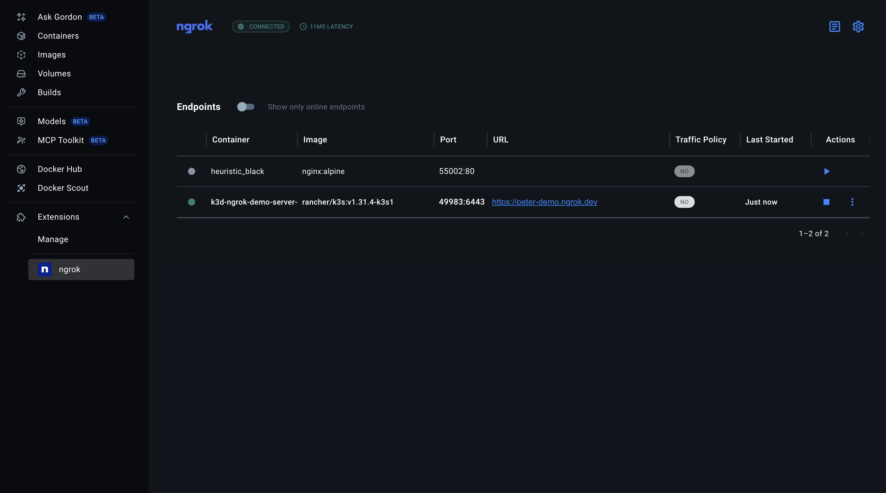

# ngrok Docker Desktop Extension

Make your local Docker containers accessible on the internet using [ngrok](https://ngrok.com)’s secure, global network—no port forwarding required. This Docker Desktop extension creates public, shareable URLs and routes traffic directly to your containers with a click.

Looking for a CLI-first workflow? See the [Docker image](#docker-image).

## Installation

[Install from Docker Desktop Marketplace](https://open.docker.com/extensions/marketplace?extensionId=ngrok/ngrok-docker-extension).

## Quick start

After installing the extension:

1. When prompted, add your ngrok authtoken. Don’t have one? [Sign up for a free ngrok account](https://dashboard.ngrok.com/signup) to get it.
2. Click the `+` next to a container to start an endpoint.
3. Optionally set a custom URL and apply a [traffic policy](https://ngrok.com/docs/traffic-policy/).
4. Share the public URL with anyone who needs access.

## Screenshot

## Development

See `AGENT.md` for local development.

## Docker image

Prefer a terminal over a GUI? Use the [ngrok Docker image](https://hub.docker.com/r/ngrok/ngrok).

Ideal for automation, scripting, and DevOps workflows.

Links:
- [ngrok Docker image on Docker Hub](https://hub.docker.com/r/ngrok/ngrok)
- [ngrok Docker image on GitHub](https://github.com/ngrok/docker-ngrok)
