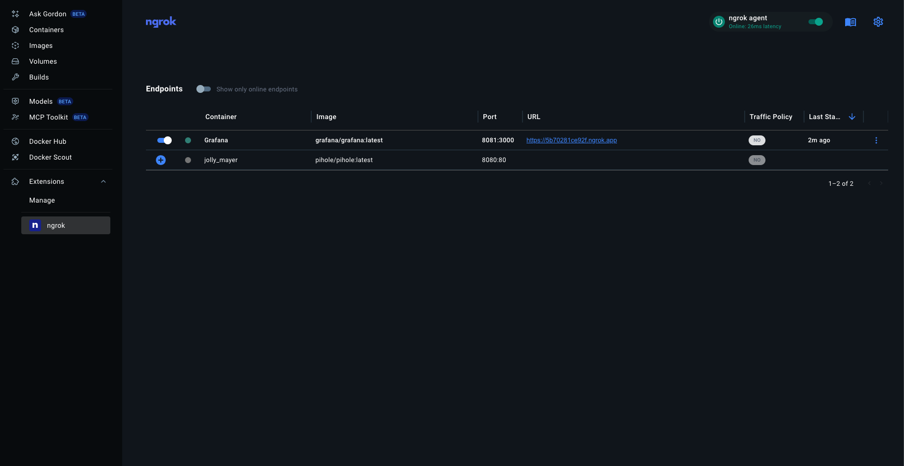

# ngrok Docker Desktop Extension

Use [ngrok](https://ngrok.com)'s API Gateway cloud service to forward traffic from internet-accessible endpoint URLs to your local Docker containers.

Go here if you're looking for the [ngrok Docker image](#docker-image).

## Installation

[Click here](https://open.docker.com/extensions/marketplace?extensionId=ngrok/ngrok-docker-extension) to add the ngrok extension to Docker Desktop.

## Quick start

After installing the extension:

1. The extension will prompt you to add your ngrok authtoken
2. Start an endpoint by clicking the `+` icon on the container you want to put online
3. Optionally specify a custom URL and [traffic policy](https://ngrok.com/docs/traffic-policy/).
4. You have an endpoint URL for your container that you can share!

## Screenshots

## Development

See [AGENT.md](AGENT.md)

## Docker Image

Perfer a terminal over GUI? You're probably looking for the [ngrok Docker Image](https://hub.docker.com/r/ngrok/ngrok).

The docker image is suited for automation, scripting, and DevOps workflows. 

Links:
- [ngrok Docker Image on Dockerhub](https://hub.docker.com/r/ngrok/ngrok)
- [ngrok Docker Image on Github](https://github.com/ngrok/docker-ngrok)
